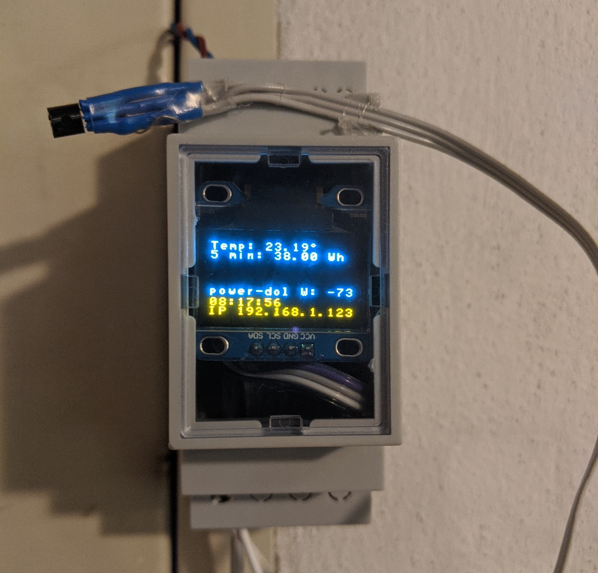

# ESP8266-PowerMonitor

See this project on <a href="https://kitspace.org/boards/github.com/jasiek/esp8266-powermonitor/"></img></a>

Uses [Lets Control It/ESP Easy](https://www.letscontrolit.com/).



## Programming

Download the latest [ESP Easy Mega release](https://github.com/letscontrolit/ESPEasy/releases).

Install [esptool.py](https://github.com/espressif/esptool). Hook up a USB-to-serial adapter to the board.

Short `_PROG` & `GND` and press RESET.

Find the right firmware file (`normal_ESP8266_4M1M`) and run:

```
$ esptool.py --port /dev/cu.usbserial-14120 --baud 115200 write_flash 0 ESP_Easy_mega_20200516_normal_ESP8266_4M1M.bin
```
